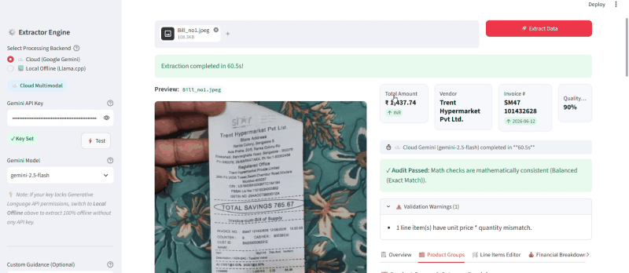
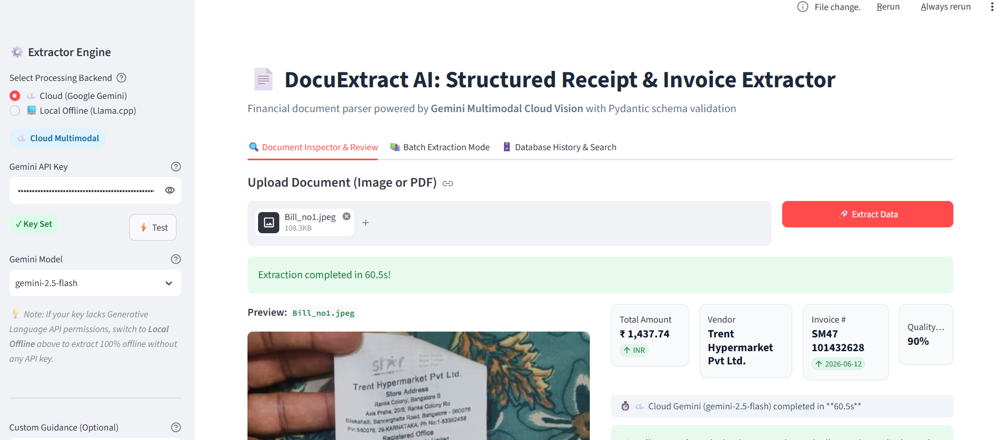
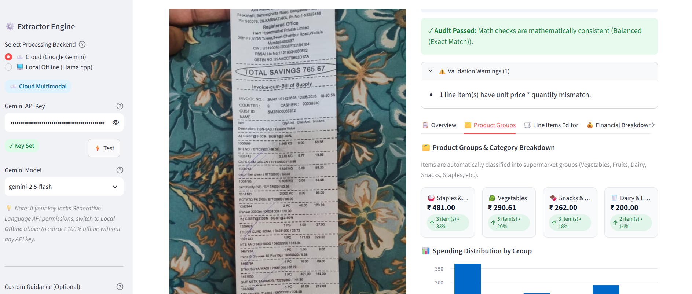
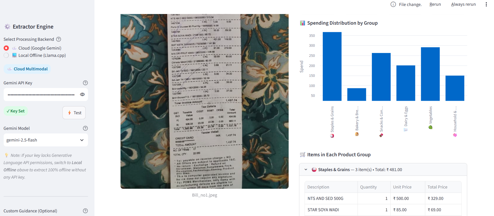
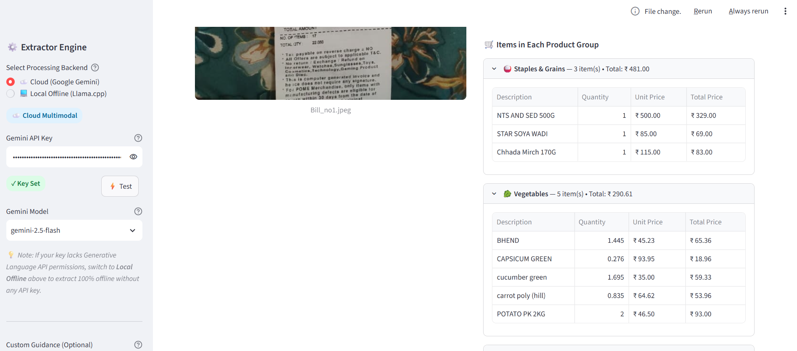
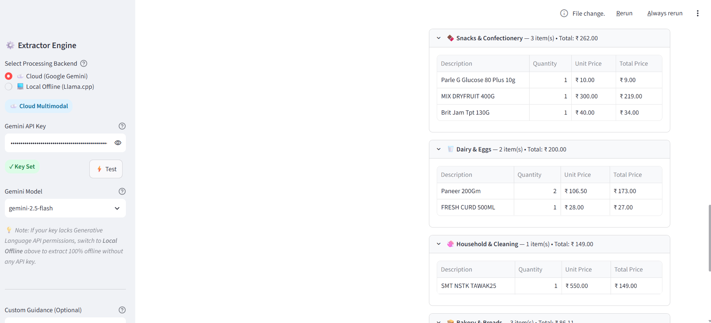
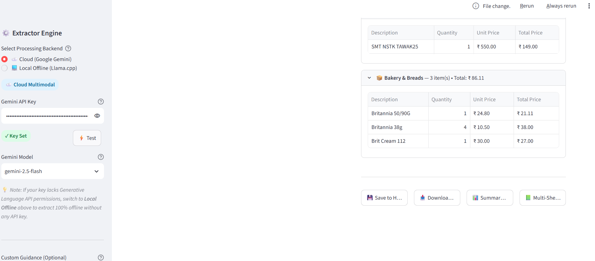

# 🧾 DocuExtract AI: Structured Receipt & Invoice Extractor

A modern, production-grade financial document parser and structured data extraction system supporting:
1. **☁️ Cloud Multimodal AI**: Powered by Google Gemini (`gemini-2.5-flash`, `gemini-2.0-flash`, `gemini-1.5-pro`) with automated 503 fallback.
2. **💻 Local Offline AI**: Powered by **`llama-cpp-python`** with GBNF grammar constraints + **`RapidOCR`** + **`json-repair`** (zero cloud API calls, 100% private, runs on CPU).

---

## ✨ Key Features

- **Dual Extraction Modes**:
  - **Cloud Mode**: High-accuracy multimodal vision extraction for complex, multi-page, creased, or faded receipts.
  - **Local Offline Mode**: Rapid local OCR + quantized GGUF LLMs (`Qwen2.5-1.5B`, `Qwen2.5-0.5B`) running locally on CPU with zero privacy leakage.
- **🥦 Smart Product Categorization & Mart Grouping**:
  - Automatically categorizes supermarket & mart items into **🥬 Vegetables**, **🍎 Fruits**, **🥛 Dairy & Eggs**, **🍞 Bakery**, **🍫 Snacks & Sweets**, **☕ Beverages**, **🍚 Foodgrains & Staples**, **🧴 Personal Care**, and **🧼 Household Essentials**.
  - Interactive "🗂️ Product Groups" breakdown showing item count, total spend, and % share per category.
- **Side-by-Side Review UI**: Visual preview of the original document on the left, with interactive parsed fields and editable tables on the right.
- **Editable Line Items Table**: Double-click directly inside the table (`st.data_editor`) to correct descriptions, categories, quantities, unit prices, or amounts before exporting.
- **Automated Mathematical Audit & Sanity Checks**:
  - Dual-formula consistency auditor handling both B2B gross invoices and retail mart post-discount receipts (`TOTAL SAVINGS`).
  - Verifies `Subtotal - Discounts + Taxes + Shipping + Tip == Total Amount`.
  - Flags unit price × quantity discrepancies on line items.
  - Computes a comprehensive Data Quality & Completeness score (0–100%).
- **Batch Processing Mode**: Upload multiple files simultaneously, process them in parallel with progress tracking, and generate a consolidated report.
- **Multi-Format Export**:
  - Single/Batch **JSON**
  - Summary **CSV** & Line Items **CSV** (with Category column)
  - Consolidated Multi-Sheet **Excel (`.xlsx`)** with a dedicated **Category Summary** sheet.
- **Local SQLite History Database**: Automatically saves extractions so past invoices can be searched, reviewed, or exported anytime.

---

## 🎬 Live Walkthrough & Interactive Demo

<p align="center">
  
</p>

> [!TIP]
> 📺 **[Click here to watch or download the full HD video walkthrough](assets/demo_walkthrough.mp4)**.

---

## 📸 Application Screenshots

### 1. ☁️ Intelligent Cloud Vision & KPI Dashboard
Side-by-side preview with automatic key metric extraction (Vendor, Invoice Number, Total Amount, Quality Score):
<p align="center">
  
</p>

### 2. 🧾 Automated Mathematical Consistency & Mart Grouping
Dual-formula math auditor passing retail mart post-discount receipts with instant category breakdown:
<p align="center">
  
</p>

### 3. 📊 Category Spending Distribution & Itemized Breakdown
Interactive analytics chart displaying spending distribution across mart departments:
<p align="center">
  
</p>

### 4. 🥬 Smart Grocery & Produce Classification
Automated grouping of fresh produce (bhindi, capsicum, cucumber, carrot, potato) with itemized weight & prices:
<p align="center">
  
</p>

### 5. 🥛 Dairy, Snacks & Household Essentials
Categorized dairy products (Paneer, Curd), packaged snacks, and household essentials:
<p align="center">
  
</p>

### 6. 🍞 Bakery Department & 1-Click Multi-Format Export
Bakery line items with one-click export to multi-sheet Excel, CSV, JSON, and SQLite History:
<p align="center">
  
</p>

---

## 📁 Project Structure

```text
invoice-receipt-extractor/
├── app.py                      # Interactive Streamlit Web Application (Cloud + Local)
├── requirements.txt            # Python dependencies
├── packages.txt                # Linux container dependencies for Streamlit Cloud
├── .env.example                # Sample environment file for API keys
├── assets/                     # UI screenshots and video demonstrations
│   ├── demo_preview.gif        # Auto-looping demo preview
│   ├── demo_walkthrough.mp4    # Full HD video walkthrough
│   └── *.png                   # High-resolution feature screenshots
├── extractor/
│   ├── __init__.py
│   ├── schemas.py              # Pydantic data schemas with LineItem.category
│   ├── categorizer.py          # Smart item categorizer & supermarket group engine
│   ├── gemini_extractor.py     # Gemini Multimodal client & prompt logic with 503 retry
│   ├── llama_extractor.py      # Llama.cpp GGUF client with json-repair
│   ├── local_ocr.py            # Local OCR engine using RapidOCR & pypdf
│   ├── validator.py            # Math verification, retail receipt checks, & quality score
│   ├── exporter.py             # JSON, CSV, and multi-tab Excel exporters with category tab
│   └── db.py                   # Embedded SQLite storage for extraction history
├── models/                     # Downloaded local GGUF models stored here (git-ignored)
├── samples/
│   ├── sample_restaurant_receipt.png  # Synthetic restaurant receipt for testing
│   ├── sample_invoice.pdf             # Synthetic tech invoice PDF for testing
│   └── generate_samples.py            # Generator script for test documents
└── tests/
    └── test_pipeline.py        # Validation, OCR, and export integration tests
```

---

## 🚀 Quick Start

### 1. Installation
Clone the repository and install dependencies:
```bash
git clone https://github.com/<your-username>/<repo-name>.git
cd <repo-name>
pip install -r requirements.txt
```

### 2. Configure Environment (Optional)
Copy `.env.example` to `.env` and insert your Gemini API Key:
```bash
cp .env.example .env
```
*(Get a free key from [Google AI Studio](https://aistudio.google.com/app/apikey))*

### 3. Launch the Streamlit Web UI
Run:
```bash
streamlit run app.py
```
This will open the application in your browser at `http://localhost:8501`.

---

## ☁️ Deploying to Streamlit Community Cloud

1. Push this repository to your GitHub account.
2. Visit [share.streamlit.io](https://share.streamlit.io) and log in with your GitHub account.
3. Click **"New app"** and select:
   - **Repository**: `<your-username>/<repo-name>`
   - **Branch**: `main`
   - **Main file path**: `app.py`
4. Expand **"Advanced settings"** -> **"Secrets"**, and paste your API key:
   ```toml
   GEMINI_API_KEY = "your_actual_gemini_api_key_here"
   ```
5. Click **"Deploy"**! Streamlit Cloud will build and launch your live application with a shareable URL.

---

## 🛡️ License & Privacy
- **Cloud Mode**: Data is sent via encrypted HTTPS to Google Gemini API following Google's API privacy terms.
- **Local Mode**: All OCR and LLM inference occurs 100% locally on your machine CPU with zero outbound data transfer.
